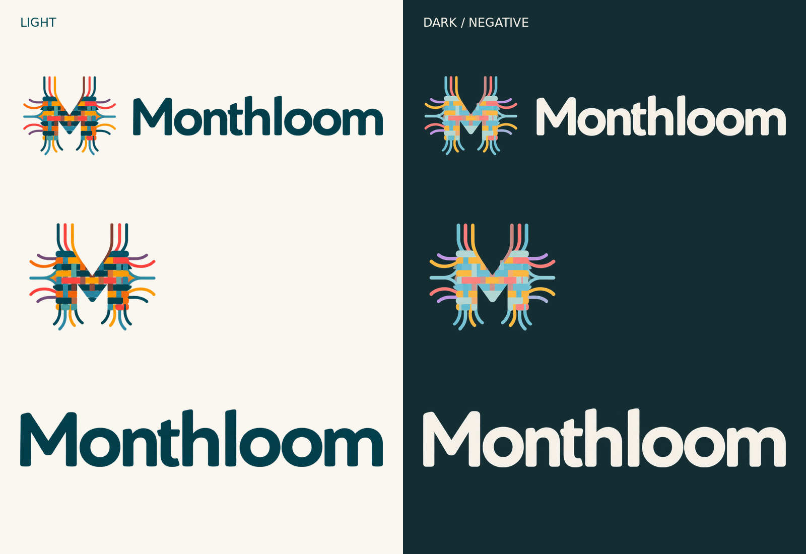
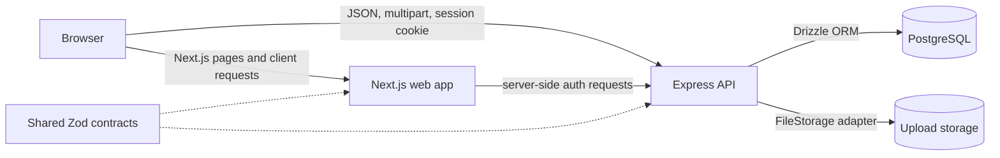

# Monthloom

**Shared household finances, woven together month by month.**

Monthloom is a collaborative household finance application for tracking income and expenses in
one place. It gives households a shared monthly view while keeping entries attributable to the
right person, source, and category.



## What you can do

- Create multiple households and choose a primary household.
- Invite registered users to collaborate through secure, expiring links.
- Record income and expenses for any household member.
- Organize transactions by source, category, date, color, and icon.
- See monthly income, spending, and the amount left over at a glance.
- Filter and sort a month's transactions, or move between months and households.
- Create recurring transactions and project them into future months.
- Edit or remove one occurrence, future occurrences, or an entire recurring series.
- Maintain household-specific sources and copy selected sources between households.
- Upload, download, and manage personal image files.
- Personalize profiles and choose from five themes in light or dark mode.

## How Monthloom is used

After registering, you create a household and add the sources you want to track—for example a
salary, grocery store, utility provider, or subscription. You can then add income and expenses to
the shared dashboard, assigning each entry to a household member and optionally making it
recurring.

The dashboard opens on the primary household and current month. Summary cards show the complete
monthly totals, while filters help answer more focused questions such as how much one person
spent, what went to a particular category, or which entries recur. Moving to a future month shows
projected recurring entries alongside any transactions already recorded there.

Household settings cover invitations, membership, ownership, and visual identity. Source settings
keep payees and income origins consistent across entries. Each person also controls their own
display name, profile image, identifying color, and browser-local appearance preferences.

## Testing

Run `pnpm test:db:up`, then `pnpm test` for all unit and integration tests. Run
`pnpm test:unit` without Docker, or target a module with `pnpm test finance`.
Stop the isolated test database with `pnpm test:db:down`.

GitHub Actions runs lint, type checks, tests and coverage checks on pull requests and pushes.
See [the testing guide](docs/testing.md) for package commands, watch mode, test isolation,
coverage reports, adding regression tests and requiring tests before deployment.

## Architecture

Monthloom is a pnpm workspace with two independently deployable applications and a shared
contract package.



- **Web application:** Next.js App Router with server-rendered authentication gates and
  interactive React client components.
- **API:** an Express modular monolith organized into routes, controllers, services, repository
  interfaces, and PostgreSQL adapters.
- **Data:** PostgreSQL is the source of truth. Monetary totals are calculated in integer cents,
  and recurring transactions are stored as occurrences with future projections synthesized by
  the API.
- **Contracts:** shared Zod schemas define and validate the transport boundary between the web app
  and API.
- **Files:** metadata and ownership live in PostgreSQL; binary content is accessed through a
  replaceable storage interface backed by the local filesystem in this repository.

For request flows, the data model, module boundaries, and architectural decisions, see
[`docs/architecture.md`](docs/architecture.md) and [`docs/adr`](docs/adr/).

## Tech stack

| Area                 | Technology                                                      |
| -------------------- | --------------------------------------------------------------- |
| Language             | TypeScript                                                      |
| Frontend             | Next.js 14, React 18, TanStack Query, React Hook Form           |
| Backend              | Node.js, Express 5, Zod                                         |
| Database             | PostgreSQL 16, Drizzle ORM                                      |
| Authentication       | Server-side sessions, HttpOnly cookies, Argon2 password hashing |
| API documentation    | OpenAPI 3, Swagger UI                                           |
| Infrastructure       | Docker Compose, pnpm workspaces                                 |
| Logging and security | Pino, Helmet, CORS and request rate limiting                    |

## Repository layout

```text
apps/
  api/                 Express API, business logic, persistence and storage
  web/                 Next.js application and feature UI
packages/
  contracts/           Shared Zod schemas and public TypeScript types
  eslint-config/       Shared lint configuration
docs/
  adr/                 Architecture decision records
  architecture.md      Detailed technical architecture
infrastructure/docker/ Container-specific documentation
```

## Run locally

### Prerequisites

- Node.js 20.11 or newer
- pnpm 9 or newer
- Docker with Docker Compose

### Setup

```bash
cp .env.example .env
pnpm install
pnpm docker:up
pnpm db:migrate
pnpm db:seed
```

Change `SESSION_SECRET` in `.env` before starting. Seeding is optional and intended only for local
development; its credentials are configured in the same file.

Once the containers are healthy, open [http://localhost:3000](http://localhost:3000). The API is
available at [http://localhost:4000](http://localhost:4000). When the API is running in development
mode, Swagger UI is available at
[http://localhost:4000/api/docs](http://localhost:4000/api/docs).

To stop the stack:

```bash
pnpm docker:down
```

For an application-focused development loop, run PostgreSQL separately and launch the API and web
app with watch mode:

```bash
docker compose up -d postgres
pnpm db:migrate
pnpm dev
```

## Development commands

| Command             | Purpose                                           |
| ------------------- | ------------------------------------------------- |
| `pnpm dev`          | Run contracts, API, and web development processes |
| `pnpm build`        | Build every workspace package                     |
| `pnpm typecheck`    | Type-check every workspace package                |
| `pnpm lint`         | Lint every workspace package                      |
| `pnpm format:check` | Check formatting with Prettier                    |
| `pnpm db:migrate`   | Apply database migrations                         |
| `pnpm db:seed`      | Add development seed data                         |
| `pnpm docker:logs`  | Follow logs from the Compose stack                |

## Security and deployment

Monthloom hashes passwords with Argon2 and stores only hashes of opaque session and invitation
tokens. Protected pages are authenticated on the server, while API services enforce household
membership and ownership. The API also applies origin checks, secure HTTP headers, explicit CORS
origins, input and upload validation, request limits, and consistent error responses with request
IDs.

The included Compose configuration is intended for local use. Before a production deployment,
review [`docs/production-concerns.md`](docs/production-concerns.md), including HTTPS, secrets,
backups, durable object storage, migrations, observability, and upload scanning.

## License

Monthloom is available under the [MIT License](LICENSE).
