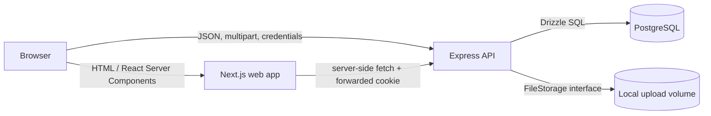
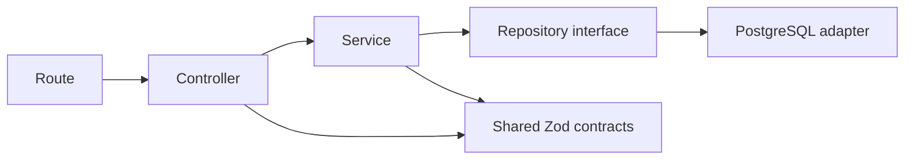
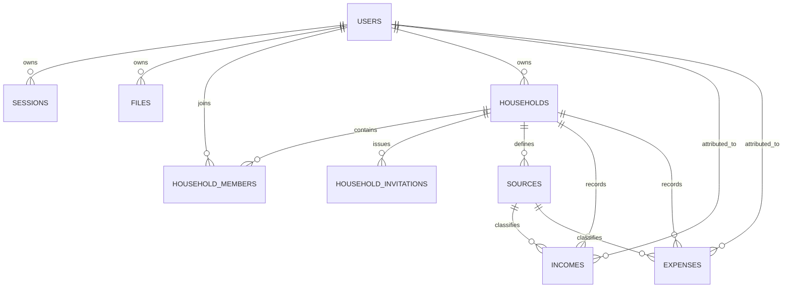
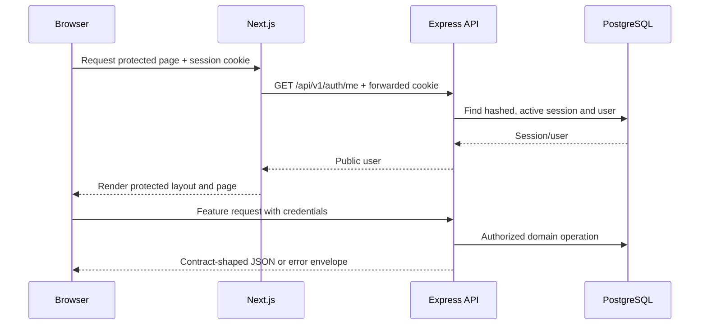

# Monthloom technical architecture

## 1. Purpose and scope

Monthloom is a collaborative household finance application. Authenticated users organize income
and expenses by household, month, member, and source; invite other users into a household; and
manage recurring transactions. The repository also contains profile, appearance, and owned-file
management features.

This document describes the implemented system: its runtime architecture, application modules,
data model, important request flows, security controls, and operational characteristics. The
accepted design decisions behind it are recorded separately in [`docs/adr`](./adr/).

## 2. Functional overview

### Identity and profiles

- Register with email, password, and display name, then receive a server-side session.
- Log in, inspect the current identity, log out, and revoke the active session.
- Edit the display name, profile image, and preferred identifying color.
- Protect application pages on the Next.js server before rendering them.

### Household finance

- Create multiple households and select one primary household per user.
- Edit a household's name, icon, and color.
- Invite another registered user with a single-use, expiring link.
- List and remove members, leave a household, transfer ownership when its owner leaves, and delete
  a household as its owner.
- Record income and expenses for any member of the household. Entries include a date, amount,
  source, icon, color, recurrence settings, and an expense category where applicable.
- View monthly income, expenses, and leftover totals.
- Browse months and sort or filter transactions by kind/category, member, source, recurrence,
  date, or amount.
- Edit or remove one occurrence or a selected portion of a recurring series.
- Project recurring transactions into future months.
- Create and maintain household-specific sources, including normalized keys and aliases; copy
  selected sources between households.

### Supporting features

- Upload, list, download, and delete user-owned JPEG, PNG, and WebP files.
- Select one of five visual themes and light or dark mode. Appearance is stored locally per browser
  rather than in the user profile.
- Expose liveness/readiness probes, an OpenAPI document, and development-only Swagger UI.

## 3. System context



There are two independently deployable application processes:

- `apps/web`: Next.js 14 App Router frontend, rendering both server and client components.
- `apps/api`: Express 5 modular-monolith API. It owns business rules, authorization, persistence,
  sessions, and file storage.

PostgreSQL is the system of record. Uploaded binary content is stored separately on the local
filesystem while metadata and ownership remain in PostgreSQL. `packages/contracts` is compiled
and consumed by both applications.

## 4. Repository organization

| Path                          | Responsibility                                                            |
| ----------------------------- | ------------------------------------------------------------------------- |
| `apps/web/src/app`            | Routes, layouts, metadata, redirects, and server-side authentication gate |
| `apps/web/src/features`       | Feature-specific UI and browser API functions                             |
| `apps/web/src/components`     | Shared UI, layout, profile, and theme components                          |
| `apps/web/src/lib`            | API client, configuration, authentication helpers, and error types        |
| `apps/api/src/modules`        | Backend feature modules: auth, users, finance, files, and system          |
| `apps/api/src/infrastructure` | PostgreSQL, storage, security, logging, and OpenAPI adapters              |
| `apps/api/src/middleware`     | Cross-cutting HTTP security, rate limits, errors, and 404 handling        |
| `packages/contracts`          | Zod transport schemas, public DTO types, identifiers, and constants       |
| `docs/adr`                    | Architectural decision records                                            |
| `infrastructure/docker`       | Container-specific documentation                                          |

The workspace uses pnpm. The root scripts orchestrate builds, development servers, linting,
typechecking, formatting, database migration, and seeding across packages.

## 5. Backend architecture

### Modular monolith and dependency direction

Each API feature follows the same dependency flow:



- **Routes** bind URLs and middleware.
- **Controllers** translate Express requests and responses, parse contract schemas, and choose HTTP
  status codes.
- **Services** enforce business rules and authorization without depending on Express.
- **Repository interfaces** define feature-specific persistence operations in domain language.
- **PostgreSQL adapters** implement those interfaces with Drizzle ORM and transactions.

`apps/api/src/composition.ts` is the explicit composition root. It creates repositories and the
local file-storage adapter, injects them into services, constructs controllers, and supplies auth
middleware. There is no dependency-injection framework or global service locator.

### HTTP pipeline

`createApp` installs middleware in this order:

1. Proxy trust configuration and removal of the Express signature.
2. Helmet security headers and credential-aware CORS with an explicit origin allowlist.
3. Response compression and structured Pino HTTP logging.
4. Size-limited JSON parsing and cookie parsing.
5. General request rate limiting.
6. Health and versioned application routes.
7. Not-found handling and centralized error translation.

All versioned endpoints use `/api/v1`. State-changing versioned requests are checked by
`verifyRequestOrigin` against configured allowed origins. Authentication-specific endpoints also
have a stricter rate limiter.

### Modules

#### Auth

Registration normalizes the email, rejects duplicates, hashes passwords with Argon2, creates a
database-backed session, and returns the public user. Login verifies the password and creates the
same kind of session. The raw opaque token is only returned in an HttpOnly cookie; its SHA-256
hash is persisted. Logout marks the session revoked and clears the cookie. Session validation
rejects missing, revoked, or expired rows.

#### Users

The users module exposes the current public profile and profile updates. Internal user records,
including `passwordHash`, are never exported through the shared contract package.

#### Finance

The finance service applies household membership checks to reads and writes. Ownership is a
stronger permission used for member removal and household deletion. Other members may edit basic
household properties and create invitations, transactions, and sources.

Important invariants include:

- A transaction's selected user and source must belong to its household.
- A user may have at most one primary household.
- An owner cannot remove themselves through member removal. When leaving a multi-member household,
  the owner must transfer ownership to another current member.
- A source display key is unique within a household. A source in use by a transaction cannot be
  deleted.
- Source copying requires membership in both the source and target households and skips names
  already present in the target.
- Invitation tokens are stored as hashes, expire, and can only be accepted once.

Income and expenses are separate persistence types but are merged into one
`HouseholdTransaction` transport representation. Amount totals are calculated in integer cents in
the service to avoid binary floating-point errors.

#### Files

The upload route uses Multer memory storage for one file up to the configured limit. It checks the
extension before service execution and inspects the actual bytes/MIME type before persistence.
The service stores generated storage keys rather than client filenames, writes content through the
`FileStorage` interface, and records metadata in PostgreSQL. Every list, metadata, content, and
delete operation is owner-scoped.

The current `LocalFileStorage` adapter is suitable for development and a persistent single-node
volume. An object-storage implementation can replace it at the composition root without changing
the file service.

#### System

- `GET /health/live` confirms that the process is running.
- `GET /health/ready` checks dependencies, including database readiness.

### Error model

Controllers and services throw typed application errors for validation, authentication,
authorization, missing records, and conflicts. The final middleware serializes errors as:

```json
{
  "error": {
    "code": "VALIDATION_ERROR",
    "message": "The submitted data is invalid.",
    "details": { "field": ["Reason"] },
    "requestId": "request-correlation-id"
  }
}
```

Zod, Multer, malformed JSON, and oversized-body errors are mapped into the same envelope.
Unexpected exceptions are logged with their request ID, while the client receives no stack trace
or internal detail.

## 6. Frontend architecture

### Rendering and routing

The App Router divides pages into public and authenticated route groups. The authenticated layout
calls `getServerUser`, forwards the incoming cookie to the API through `API_INTERNAL_URL`, and
redirects unauthenticated requests to `/login`. This prevents protected content from being sent
based only on client-side state.

Principal routes are:

| Route                  | Behavior                                                                            |
| ---------------------- | ----------------------------------------------------------------------------------- |
| `/`                    | Public landing page or the household dashboard, depending on route-group resolution |
| `/login`, `/register`  | Authentication forms with validated safe redirects                                  |
| `/invite/[token]`      | Invitation inspection and acceptance flow                                           |
| `/files`               | Owned-file upload and management                                                    |
| `/settings/profile`    | Public profile appearance fields                                                    |
| `/settings/households` | Household creation, membership, ownership, invitations, and deletion                |
| `/settings/sources`    | Source editing, deletion, and cross-household copy                                  |
| `/settings/appearance` | Local theme and color-mode selection                                                |

`/dashboard`, `/profile`, and `/settings` are compatibility/convenience redirects.

### Server and client state

React Server Components handle the authoritative page gate and initial server-owned concerns.
Interactive features are client components and use TanStack Query for API state. The shared query
client uses a 30-second stale time, one retry, and no focus-triggered refetch. Mutations invalidate
feature query keys so household summaries, settings, and lists converge on server state.

React Hook Form plus Zod resolvers validate authentication and profile forms. Finance forms use
the same shared DTO types and domain constants, with final validation repeated by the API.

The central API client:

- selects `API_INTERNAL_URL` on the server and `NEXT_PUBLIC_API_URL` in the browser;
- prefixes paths with `/api/v1`;
- includes cookies on browser requests and optionally forwards them server-side;
- supports JSON and multipart bodies;
- applies a 10-second default timeout and caller cancellation;
- disables the fetch cache; and
- converts standard API error envelopes into `ApiClientError`.

### Dashboard behavior

The household dashboard loads the household list, selects the primary household by default, and
requests a month aggregate. It can switch household/month, make the selected household primary,
create or edit transactions, and remove transactions with recurrence scope. Sorting and filters
are applied client-side to the returned monthly transaction list; summary cards retain the totals
for the full month, independent of UI filters.

### Appearance

Theme ID and light/dark mode are stored in browser `localStorage`. A small script in the root
document head applies the stored data attributes before React hydration to limit a flash of the
default theme. The preference is device/browser-local and is not synchronized through the API.

## 7. Shared contracts and validation

`@template/contracts` is the transport boundary between frontend and backend. It contains Zod
schemas and inferred TypeScript types for requests, responses, public entities, pagination,
errors, health checks, and shared enum-like constants. It intentionally excludes ORM rows,
password hashes, session tokens, repositories, and services.

Request schemas encode domain validation such as:

- UUID identifiers, ISO timestamps, calendar dates, and `YYYY-MM` month keys;
- three-letter uppercase currency codes and six-digit hexadecimal colors;
- positive decimal amounts with at most two fractional digits;
- expense-category requirements and their exclusion from income;
- recurrence expiration not preceding the entry date; and
- valid, non-duplicated recurring-series selections and source selections.

Sharing these schemas detects drift at build time, while parsing again at the API boundary keeps
the server authoritative for untrusted input.

## 8. Data model



| Table                   | Key data and constraints                                                 |
| ----------------------- | ------------------------------------------------------------------------ |
| `users`                 | Normalized unique email, Argon2 hash, display/profile fields, role       |
| `sessions`              | Unique token hash, expiry, revocation timestamp, cascading user FK       |
| `files`                 | Owner, generated unique storage key, original name, MIME type, byte size |
| `households`            | Currency, visual identity, owner; owner deletion is restricted           |
| `household_members`     | Composite household/user key, join time, per-user primary flag           |
| `household_invitations` | Unique token hash, creator, expiry, acceptance audit fields              |
| `sources`               | Household-scoped unique normalized key and aliases                       |
| `incomes`               | Positive numeric amount, member, source, date, recurrence metadata       |
| `expenses`              | Income fields plus a required expense category                           |

Database checks reinforce currency/color formats, positive amounts, and source alias rules. A
partial unique index on `household_members.user_id` where `is_primary` is true enforces the single
primary-household invariant. Composite source foreign keys prevent transactions from referring to
a source in another household.

Schema migrations are generated and tracked under
`apps/api/src/infrastructure/database/migrations`. The API does not run migrations implicitly at
startup; deployment or local setup must invoke the migration script explicitly.

## 9. Recurring transaction model

Recurring entries share a `recurrenceId`; materialized occurrences remain ordinary income or
expense rows. Future month reads also synthesize projections:

1. Load actual rows in the requested month.
2. For future months only, load earlier recurring history and group it by recurrence ID.
3. Skip a series that already has an actual occurrence in the requested month.
4. Use the latest series metadata, align its day into the requested month, and stop after
   `expiresOn`.
5. Estimate the projected amount from up to the six most recent occurrences and mark the returned
   DTO with `projected: true`.

Past and current months never contain synthetic rows. Update operations accept explicit booleans
for past, current, and future occurrences, allowing non-contiguous selection. Delete operations
use the simpler scopes `current`, `current_and_future`, or `past_current_and_future`. Repository
transactions keep cross-table kind changes and multi-occurrence edits atomic.

## 10. Primary request flows

### Authenticated browser request



### Invitation flow

Any household member may create an invitation for an email address. The API stores only the hash
of the raw token and sends the raw token inside the invitation link by transactional email. The
public invitation lookup validates existence, unused state, and expiry without requiring
authentication. Acceptance requires a session, atomically adds membership and marks the invitation
accepted, and rejects reused, expired, or already-member cases. If email delivery fails, the newly
created invitation is removed so an unreachable token is not left behind.

### Email delivery

Automated email is composed centrally as plain text and responsive HTML, then sent through an
`EmailSender` infrastructure interface. The SMTP adapter works with conventional transactional
email providers; a log adapter is the safe local default and records recipient/subject metadata
without leaking token-bearing message bodies. Account verification, password reset, household
invitation, and monthly report templates are available, while each feature remains responsible for
token lifecycle and scheduling. Configure `EMAIL_TRANSPORT=smtp`, sender identity, and SMTP
connection variables to enable real delivery.

### File upload flow

The API receives a single in-memory multipart part, checks configured size/type rules, derives a
safe storage key, writes bytes through `FileStorage`, and then persists owner-scoped metadata. The
service compensates for metadata failure by removing newly written binary content. Downloads
resolve metadata ownership before opening the stored content.

## 11. API surface

The major route groups are:

| Base path            | Operations                                                                                   |
| -------------------- | -------------------------------------------------------------------------------------------- |
| `/api/v1/auth`       | Register, login, logout, current session user                                                |
| `/api/v1/users`      | Read and update the current profile                                                          |
| `/api/v1/households` | Household CRUD, primary selection, members, invitations, monthly view, transactions, sources |
| `/api/v1/files`      | Upload, list, metadata, content, delete                                                      |
| `/health`            | Liveness and readiness                                                                       |

The generated OpenAPI 3.0 document is served at `/api/v1/openapi.json`. In development, Swagger
UI is mounted at `/api/docs`. Route handlers and shared Zod schemas remain the authoritative
implementation if the generated description and code ever differ.

## 12. Security model

- Passwords are hashed with Argon2.
- Session tokens are cryptographically random, opaque, hashed at rest, expiring, and revocable.
- Session cookies are `HttpOnly`, `SameSite=Lax`, path-scoped to `/`, and `Secure` when configured.
- Authenticated CORS uses explicit origins and credentials; write requests additionally verify
  `Origin` as CSRF defense in depth.
- Server-side protected layouts never trust client query state as an authorization decision.
- Services enforce record ownership and household membership; UI visibility is not a security
  boundary.
- Helmet, request/body/upload limits, authentication throttling, and general rate limiting reduce
  common HTTP attack surface.
- Upload validation checks actual content type and isolates storage names from user filenames.
- Error responses omit stack traces and carry correlation IDs for server-side investigation.
- Environment variables are parsed with Zod and invalid configuration fails startup.

Admin/user roles exist in the identity model and reusable role middleware is composed, but the
current user-facing route set is governed primarily by ownership and household membership rather
than admin-only endpoints.

## 13. Configuration and operation

Requirements are Node.js 20.11+, pnpm 9+, and PostgreSQL 16 for the supplied Compose setup. Copy
`.env.example` to `.env` and provide real secrets before starting the applications.

Common commands from the repository root:

```bash
pnpm install
pnpm docker:up
pnpm db:migrate
pnpm db:seed       # development only
pnpm dev

pnpm typecheck
pnpm lint
pnpm build
```

Docker Compose starts PostgreSQL, the API on port 4000, and the web app on port 3000. It uses named
volumes for database and upload persistence and waits for service health before starting
dependents. `API_INTERNAL_URL` lets the Next.js server address the API by its container hostname,
while `NEXT_PUBLIC_API_URL` must be reachable by the visitor's browser.

Structured application and request logs go through Pino. Request IDs connect HTTP responses with
warning/error records. Metrics, distributed traces, hosted error reporting, and backup automation
are not currently included.

## 14. Testing and production boundaries

No automated unit, integration, or end-to-end test suite is currently present in the repository.
The available verification gates are TypeScript typechecking, ESLint, Prettier checks, builds,
database constraints, runtime Zod parsing, and manual/API testing. Finance recurrence behavior,
authorization boundaries, invitation races, and file storage compensation are the highest-value
areas for future automated coverage.

Before production deployment, the implementation still requires environment-specific work:

- terminate HTTPS and enable secure session cookies;
- use managed PostgreSQL with backup and recovery procedures;
- replace local file storage with durable object storage for horizontal API scaling;
- provide production secret management;
- authenticate the sending domain (SPF, DKIM, and DMARC), configure SMTP delivery, and monitor
  bounces/complaints;
- establish database migration and rollback procedures;
- add observability, retention, and alerting; and
- define malware scanning/content policy for uploads where required.

See [`production-concerns.md`](./production-concerns.md) for the maintained deployment checklist.

## 15. Extension points

- Add a storage provider by implementing `FileStorage` and changing the composition root.
- Add persistence implementations by satisfying the feature-specific repository interface.
- Add a backend feature as a route/controller/service/repository module and register it in
  `composition.ts` and `routes.ts`.
- Add transport types only to `packages/contracts`; keep internal domain and database types in the
  API.
- Extend the OpenAPI registry whenever a route is introduced or changed.
- Add frontend functionality under a feature directory with a typed API module and scoped TanStack
  Query keys.
